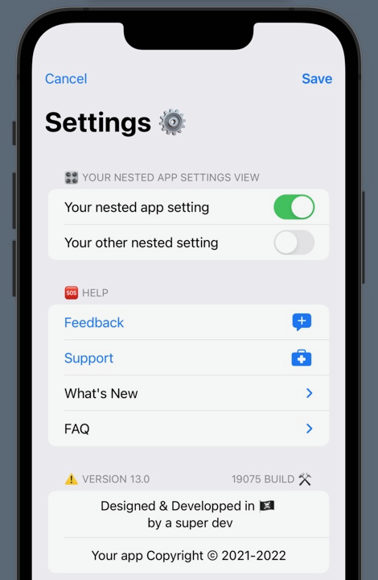

# **PackAPrefPane**

### *Reusable & customizable SwiftUI settings sheet as a Swift package*
### Initial version made at November 2021 SwiftUI Jam https://www.swiftuijam.com


## Features
* Swift package
* 100% Swift
* 100% SwiftUI
* Simple design
* Lightweight
* Customizable
* Localized for EN & FR
* Nothing exotic
* Open source
* Target: iOS 14 >



## Usage
* Import `PackAPrefPane` Swift package
* Setup a var with `PrefPaneData` type and customize each variable to your needs
* Setup your nested `appSettingsView` within a SwiftUI `Section` view
* Make sure you have a var for showing sheets `settingsSheetPresented: Bool`
* Use `PackAPrefPane` view with the above variables as in this example:  
```
PackAPrefPane(  
    settingsSheetPresented: yourSheetbool,  
    prefPaneData: yourPrefPaneData  
) {  
    Section(header: Text("Your nested app settings view section")) {  
        YourNestedAppSettingsView()  
    }  
}  
``` 

## [Custom TYPES](TYPES.md)

## Project resources
* Mind map in MindNode format
* Logo design in AffinityDesigner format

## License
PackAPrefPane is designed and coded by W1W1-M and released under MIT license
