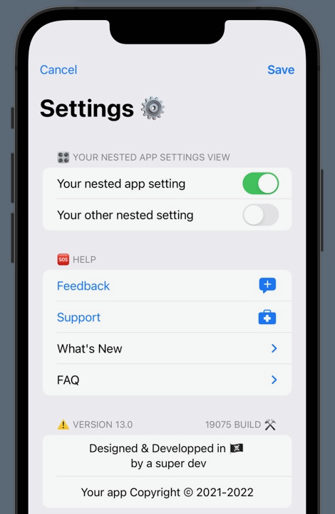

# **PackAPrefPane**

### *Reusable & customizable SwiftUI settings sheet as a Swift package*
### Initial version made at November 2021 SwiftUI Jam https://www.swiftuijam.com

## Features
* Swift package
* 100% Swift
* 100% SwiftUI
* Simple design
* Lightweight
* Customizable
* Localized for EN & FR
* Nothing exotic
* Open source
* Target: iOS 14 >

## Usage
* Import `PackAPrefPane` Swift package
* Setup a var with `PackAPrefPaneData` type
* Setup your custom `appSettingsView` in a SwiftUI `Section` view
* Make sure you have a var for showing sheets `settingsSheetPresented: Bool`
* Use PackAPrefPane view, example:  
`PackAPrefPane(`  
    `settingsSheetPresented: yourSheetbool,`  
    `packAPrefPaneData:  yourPrefPaneData`  
`) {`  
    `Section(header: Text("Example settings view")) {`  
        `Text("Some important app setting")`  
    `}`  
`}`  

### PackAPrefPaneData type
#### Help section
`showFeedbackLink: Bool` // Show or drop feedback link  
`showSupportLink: Bool` // Show or drop support link  
`showWhatsNew: Bool` // Show or drop changelog text  
`showFAQ: Bool` // Show or drop frequently asked questions disclosure group  
`appID: String`  
`changelogText: String`  
`faq: [FrequentlyAskedQuestions]` // Array of FrequentlyAskedQuestions  
#### AppInfo section
`developerInfoText: String`  
`appCopyrightText: String`  
`thirdPartyCode: [ThirdPartyCode]` // Array of ThirdPartyCode  
#### Legal section
`showDisclaimer: Bool` // Show or drop disclaimer button  
`showPrivacyPolicy: Bool` // Show or drop privacy policy button  
`showSpecialThanks: Bool` // Show or drop special thanks button  
`disclaimerText: String`  
`privacyPolicyText: String`  
`specialThanksText: String`  

### FrequentlyAskedQuestions type
`id = UUID()` // Identifiable for ForEach  
`question: String`  
`answer: String`  

### ThirdPartyCode type
`id = UUID()` // Identifiable for ForEach  
`sourceNameText: String` // Third party code name and developer  
`sourceURLText: String` // Full URL to code web page  
`sourceLicenseText: String` // Source code license name  

## Project resources
* Mind map in MindNode format

## License
PackAPrefPane is designed and coded by W1W1-M and released under MIT license
